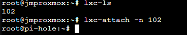
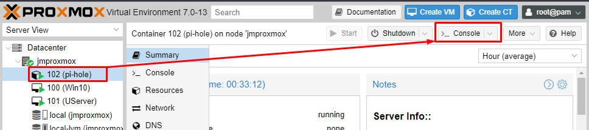

# Pi-Hole_lxc
A Nested Container implementation of Pi-Hole

# Title
<div align="center">
 
</div>

## Resources deployed by this manifest:

### Deployment diagram:



## Tested with: 

| Environment | Application | Version  |
| ----------------- |-----------|---------|
| WSL2 Ubuntu 20.04 | Terraform | v1.0.0  |

## Initialization How-To:

### Enable SSH:

Connect to the container: 

- **Option #1**: Using the ">_ Console" button from the GUI.



- **Option #2**: From the proxmox host console using:

```bash
# Get LXC ID:
lxc-ls
# Attach (ssh-like) to the container:
lxc-attach -n {Proxmox CT ID}
```


```bash
# Edit SSH config file and change "PermitRootLogin" to yes:
vi /etc/ssh/sshd_config
# Start the SSH service:
service ssh restart
# Enable SSH service on Boot:
systemctl enable ssh
```

### Install updates:

```bash
sudo apt-get update && apt-get upgrade -y
```

### Install docker and docker-compose

```bash
sudo apt-get install docker && sudo apt-get install docker-compose
```

#### Download the necesary compose manifest and scripts:


## Deployment How-To:

## Debugging / Troubleshooting:

#### **Debugging Tip #1**: 

#### **Known issue #1**: 
 - **Issue**: 
- **Cause**: 
- **Solution**: 

## Author:

- [@JManzur](https://jmanzur.com.ar)

## Documentation:

- [EXAMPLE](URL)